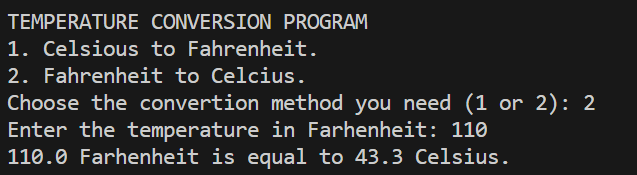
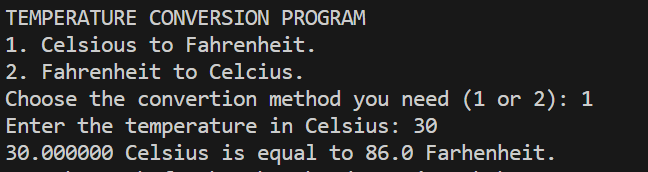

  

# 💻 Project 3 – Temperature Converter (in C)

This is **Project 3** in a series of mini exercises for **beginners learning C programming**. Each project helps you strengthen your understanding of core programming concepts like conditional logic, basic arithmetic, user input/output, and floating-point operations.

---

## 📌 About this project

This mini project is a **temperature conversion tool**, designed to convert values between **Celsius** and **Fahrenheit**.

When the program runs, it prompts the user to choose between two options:

1. Convert **Celsius to Fahrenheit**
2. Convert **Fahrenheit to Celsius**

After selecting an option, the user enters the temperature to be converted, and the program performs the calculation using a simple formula. The result is displayed in a clean and readable format with one decimal place of precision.

This exercise is perfect for practicing formatted printing and reinforcing the use of `if/else` statements in C.

---

## 📘 Conversion Formulas

The following formulas are used in this project:

- **Celsius → Fahrenheit**  
  \[
  F = (C \times 9/5) + 32
  \]

- **Fahrenheit → Celsius**  
  \[
  C = (F - 32) * 5/9
  \]

---

## 🧪 Example Output

Here are two examples of what the output might look like when running the program:

📎 Terminal example – *Fahrenheit to Celsius*:  

📎 Terminal example – *Celsius to Fahrenheit*:  

---

## 🧠 Challenge Instructions

If you’d like to practice building this yourself before looking at the solution, follow these steps:

1. Print a welcome message and display both conversion options.
2. Prompt the user to choose between the two.
3. Based on the choice:
   - Convert Celsius to Fahrenheit using the formula:  
     `Fahrenheit = (Celsius * 9 / 5) + 32`
   - Convert Fahrenheit to Celsius using the formula:  
     `Celsius = (Fahrenheit - 32) * 5 / 9`
4. Print the result formatted to one decimal place.
5. If the user enters anything other than 1 or 2, print an error message.

> **Note:** This project is already complete and includes the full solution. You can explore the code in `main.c` and check the image examples for terminal output guidance.

Happy coding! 🌡️🚀
